Los datos vienen creciendo de forma exponencial, ya cada vez es mas difícil procesar estas cantidades de datos, este fenómeno es lo que se conoce como BIG Data. 

Antes definamos los distintos tipos de Datos 

Datos Destructurados: Son datos que no tienen una estructura formal, no estan organizados, se encuentran de manera natural. Ej. de este tipo de datos son las notas, recetas medicas, twits, etc. 

Datos Estructurados: Son datos que se encuentran estructurados y organizados, por ejemplo las bases de datos relacionales pueden alojar este tipo de datos.  También en formatos JSON, etc.  Ejemplo de estos datos son los CSV, JSON, XML,etc.  

` `Datos Semiestructurados: Son datos que estan parcialmente organizados, normalmente contienen metadatos. 

Big Data: Cuando hablamos de Big Data nos referimos a cualquier dato que no puede ser almacenado o procesado por una maquina común, es decir que no los podemos almacenar y procesar de  la misma manera que haríamos con unos pequeños datos.  

Cuando hablamos de Big Data nos encontramos con las siguientes características: Velocidad: 

Variedad: 

Variabilidad: 

Veracidad:  

Volumen: 

Valor: 

Volatilidad: 

Complejidad:  

Sistemas Distribuidos:  

Son sistemas cuyos componentes son alojados en distintas maquinas conectadas entre si. Cuando decimos componentes nos referimos a Hardware, Dispositivos o Software. Que están dispuestos a funcionar independientemente uno del otro.  

Cada uno de estos componentes estarán alojados en maquinas que se denominan Nodos. Cada uno de estos nodos no tienen porque tener las mismas características. En los sistemas distribuidos los nodos interactúan uno con el otro para realizar una tarea en común.  

Cluster de Computadoras:  

Un cluster de computadoras es una colección de máquinas conectadas entre si en una área local de red. Un Cluster de computadoras es un tipo de sistema distribuido, a traves del trabajo colaborativo de estas maquinas podemos tener una gran capacidad de computo, gran almacenamiento, etc. Cada nodo de un clúster contribuye con su almacenamiento de datos  

así como sus CPUs y RAM al sistema 

Características de los clusteres de Computadoras: 

\_Cada nodo tiene el mismo SO y Hardware 

\_Los nodos suelen estar en un mismo lugar   

\_Cada nodo suele tener asignado un pequeño número de tareas bien asignadas. 

Procesamiento Paralelo: 

Consiste en la ejecución de dos o mas procesadores al mismo tiempo para manejar partes separadas de una tarea global. Las Tareas a ejecutar se dividen en partes para que cada uno de los procesadores ejecuten estas partes de manera simultanea.  

Procesamiento Distribuido: 

Es el uso de sistemas distribuidos para correr el procesamiento paralelo. Es decir una tarea se divide en partes y estas se ejecutan en distintas maquinas (nodos) al mismo tiempo.  

Sistema distribuido de almacenamiento: 

Consiste en almacenar archivos en distintos nodos, pero todo este proceso se realiza como si se estuviera realizando en una sola unidad de almacenamiento.  

Sistema Distribuido de Archivo: 

Es un sistema de Archivo que permite manejar el almacenamiento distribuido.  

Escalamiento: 

Es la capacidad de agregar recursos de manera sencilla en base a la demanda de un Sistema Big Data. 

Escalamiento Vertical: Consiste cuando a un solo sistema se le agrega mas recursos 

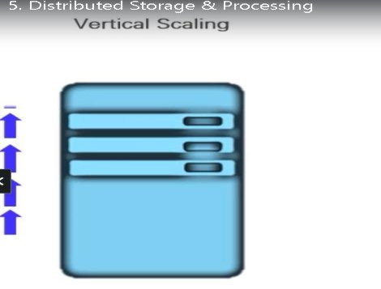

Con este tipo de escalamiento tenemos un limite, es decir en algún momento no podremos agregar mas recursos a una sola unidad. 

Escalamiento Horizontal: Consiste que en vez de agregar mas recursos a una sola unidad, directamente agregar otras unidades con las mismas características, de esta manera no tenemos limites. 

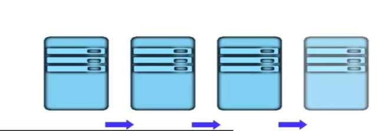

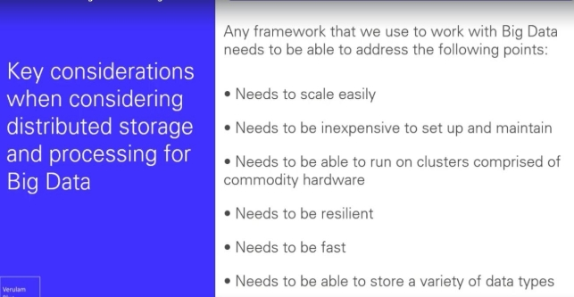

Hadoop: 

Apache Hadoop es un proyecto de  software de código abierto para la computación fiable, escalable y distribuida. El Software producido por Hadoop puede ser usado para el almacenamiento distribuido o el procesamiento distribuido de largos data sets. 

Características: \_Escalabilidad  \_Resistente a fallos 

\_Económico 

\_Flexible con los tipos de datos que puede procesar 

Componentes principales de Hadoop: 

\_Hadoop Common 

\_Hadoop Distributed File System (HDFS) ( Sistema de Archivo responsable de administrar los datos almacenados en nodos y en Hadoop) 

\_Hadoop YARN ( Conocido como un Framework para administrar  clusters de recursos como las memorias, CPU,etc, y programar los trabajos para el procesamiento de los datos) 

\_MapReduce (Responsable del procesamiento paralelo de los largos datasets) 

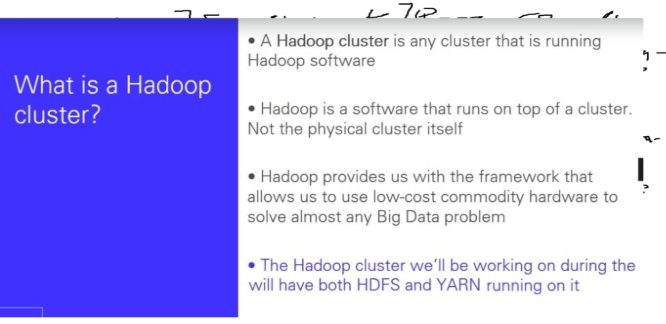

Apache Spark: 

Se define como un motor de análisis unificado para procesamiento de datos a gran escala. Cuando decimos motor nos referimos a algún componente responsable del procesamiento de datos. 

Spark es ampliamente adoptado debido a su Velocidad, fácil uso y flexibilidad. Spark se integra bien con el ecosistema de Hadoop. 

Spark puede ser bien usado para performar el preprocesamiento de los datos  

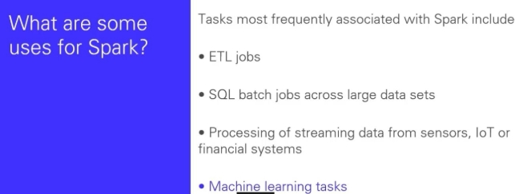

Spark Librerías  

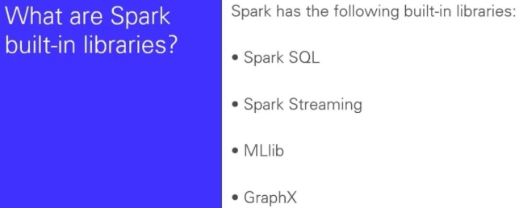

La libreria **Spark SQL** es usada por:  

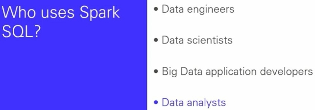

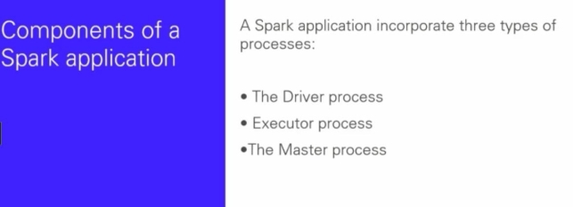

Diferencias entre Spark y Hadoop: 

https://www.ibm.com/cloud/blog/hadoop-vs-spark 

La principal diferencia es que Hadoop procesa en Discos, mientras que SPARK lo hace en memorias RAM. 

Spark es una librería que se puede usar en JAVA, Python, SCALA, etc. es decir se puede usar en cualquiera de estos lenguajes de programación.  

PySpark: 

PySpark  es la forma de interactuar con el framework Apache por medio de Python. En vez de hacerlos con lenguajes complejos como Java o Escala lo podemos hacer con Python. De esta manera a su vez podemos combinar Spark con las distintas librerías más famosas de Python 

( pandas, numPy, etc.). 

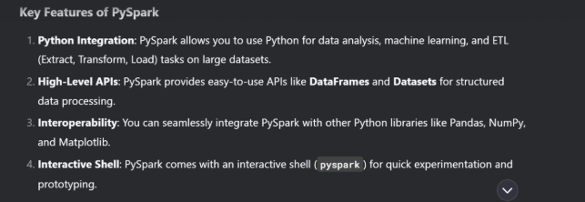

Arquitectura Básica de Spark: 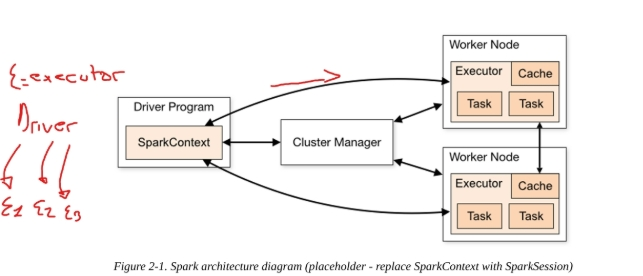

Como se aprecia en la imagen el driver es el cerebro de Spark es quien coordina y distribuye las tareas en los distintos nodos ( que ejecutaran en paralelo cierta tarea). 

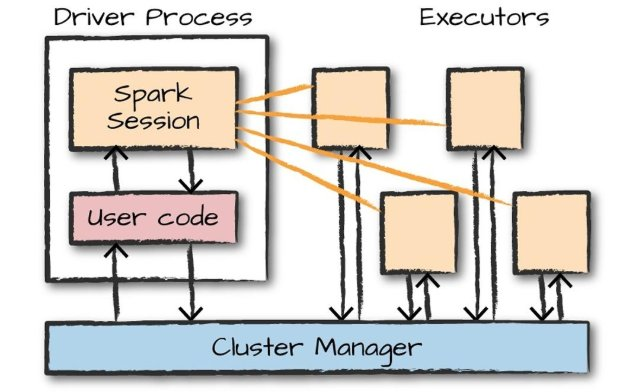

SparkSession:  Se trata de un objeto que encapsula la conexión al cluster de spark ( Al Driver en cuestión)  y proporciona los métodos necesarios para interactuar con la API de Spark. 

import pyspark 

- Create a SparkSession 

spark = pyspark.sql.SparkSession.builder.appName("MySparkApp").getOrCreate() 

- Now you can use the 'spark' variable to read the CSV file 

prev = spark.read.csv('block\_\*.csv')#llemos todos los csv que empiezan con "block...." prev.show() 

DataFrames: 

Al igual que en pandas un DF representa a una tabla con Columnas y Filas. A diferencia de Pandas 

en Spark podríamos particionar este DF en distintas computadoras o nodos.  

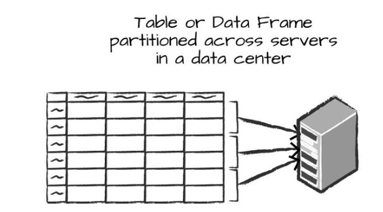

Transformations: 

Las trasnformaciones consisten en un proceso que nos permite Spark en el cual tomamos un DataFrame y producimos uno nuevo ( en este nuevo se aplico algún cambio con respecto al original). Existen dos tipos de Transformations -> 

1\_ Narrow Transformations: En estas transformaciones se agarra la partición del Dataframe que podría estar en cierto nodo y se le aplica las correspondientes transformaciones en ese mismo nodo a estar partición.  

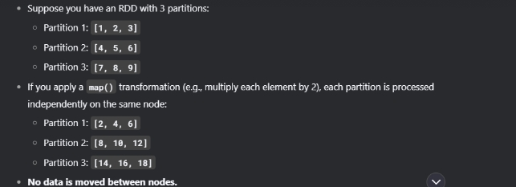

2\_ Wide Transformations:  En este caso es lo opuesto al anterior, cada partición  de cada nodo se procesa o transforma en distintos nodos.  

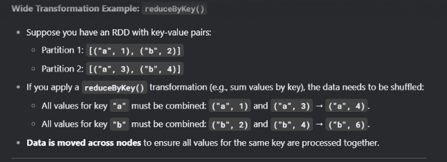

Lazy Transformations: 

Se encargan de construir el plan de ejecución de una transformación ( muchas veces combinando 

ambos tipos de transformaciones). 

Ejemplo del proceso de Transformación: 

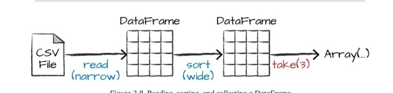

El funcionamiento de Spark se basa principalmente en DataFrames, se lee un origen, se lo carga 

como un DataFrame, a los dataframe se los conoce como RDD ( Resilient Distribuited Dataset), esto es porque cada dataframe es único y cada transformación que hagamos generara otro dataframe dejando el anterior sin modificar 

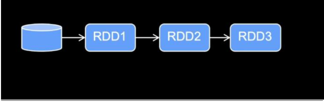

En la imagen se ve como se parte de un RDD y se a medida que se va transformando se van 

generando nuevos DF. Hay que recordar siempre que sobre cada DataFrame se generara una partición en memoria como se aprecia en la imagen siguiente: 

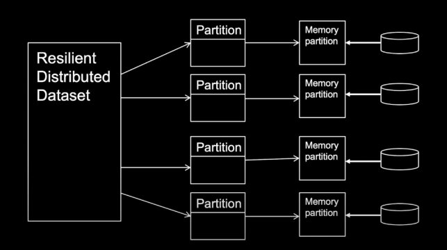

Es decir sobre cada DataFrame se generaría las particiones en los distintos clusters.  

Luego una vez que estén las Transformaciones, entra “Lazy transform” para diseñar el mejor plan 

para ejecutar las correspondientes transformaciones.  

Spark SQL: 

Es uno de los módulos que contiene Spark y nos permite interactuar con los DF por medio de SQL, 

aprovechando todo el potencial que este tiene.  

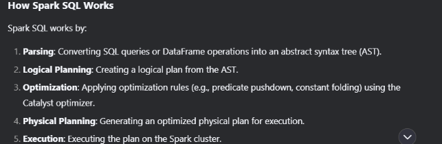

Por ejemplo leemos de la siguiente manera un CSV para pasarlo a un DF staticDataFrame = spark.read.format("csv")\ 

.option("header", "true")\ 

.option("inferSchema", "true")\ 

.load("/content/downloaded\_csv\_files/online-retail-dataset.csv") staticDataFrame.createOrReplaceTempView("retail\_data") staticSchema = staticDataFrame.schema 

Creamos otro DF en base a este pero solo para usarlo aparte para sql y no modificar el actual  staticDataFrame.createOrReplaceTempView("Sells\_data") 

Y en base a este creamos la siguiente sentencia que en la cual podemos ejecutar sentencias SQL  sqlWay = spark.sql(""" 

` `SELECT      

` `CustomerId, 

` `InvoiceDate, 

` `(UnitPrice \* Quantity) as total\_cost 

` `FROM Sells\_data 

` `GROUP BY CustomerId,InvoiceDate,UnitPrice,Quantity  order by total\_cost  desc 

` `""") 

` `sqlWay.show() 

Streaming DataFrame: 

En Apache podemos leer orígenes estáticos como por ejemplo un CSV o consultas a una API cada cierto tiempo (información que no varía con mucha frecuencia), como así también orígenes cuya información varia constantemente, esto ultimo se conoce como real time, son orígenes que 

contantemente están generando información. Ante ello en Apache tenemos una manera de tratar a estos tipos de orígenes, esto se logra por medio de   la opción de tratar a los dataframe por medio del objeto “ReadStream”.} 

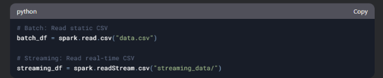

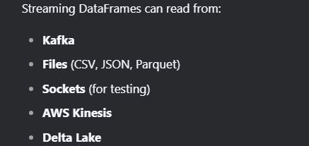

Ejemplo de leer archivos CSV que van llegando constantemente a una Folder en un servidor 

streamingDataFrame = spark.readStream\ 

.schema(staticSchema)\ 

.option("maxFilesPerTrigger", 1)\ 

.format("csv")\ 

.option("header", "true")\ .load("/content/Spark-The-Definitive-Guide/data/retail-data/by-day/\*.csv") #Se leerán todos los archivos que tengan la extensión “.CSV” 

Repartition() y Coalesce(): 

Con Repartition() podemos cambiar el numero de particiones en un DF o Dataframe incrementando 

el numero de particiones o decrementando los mismos. Es decir podemos fijar manualmente en cuantas particiones se debería dividir nuestro RDD.  

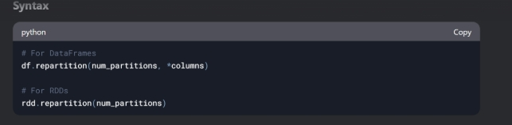

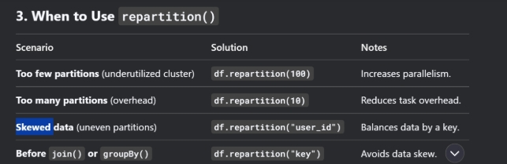

Supongamos que tenemos que hacer un JOIN entre dos RDD por medio de una columna, podemos 

hacerlo en una sola partición o cluster para evitar un uso excesivo de recursos, entonces usamos la siguiente sentencia: 

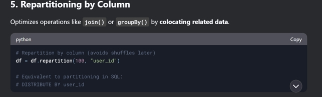

Otros usos: 

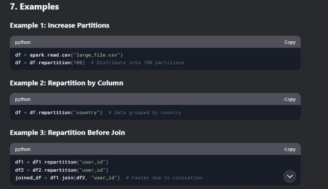

Coalesce() por el contrario se encarga de agrupar las particiones, es decir reducir las particiones.  

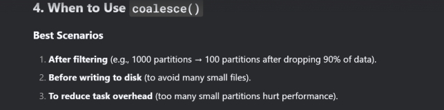

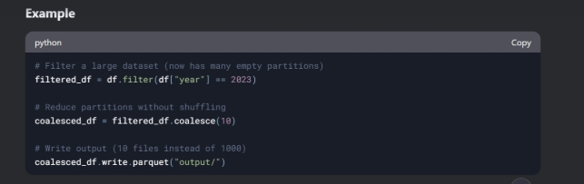

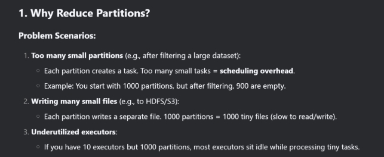
